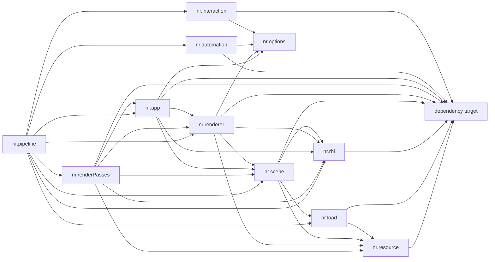
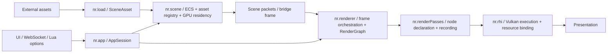

# Newbie-Renderer 系统设计审计报告

> 审计日期：2026-07-28  
> 审计对象：当前工作区中的 Newbie-Renderer 源码、CMake 构建图、架构文档与既有本机构建日志  
> 基线提交：`7eb74c75431daf2eaaed66a88b5b9b958adb53e5`，分支 `master`  
> 重要说明：工作区在审计时包含尚未提交的修改；本报告分析的是“当前工作区快照”，并非仅分析上述 Git 提交。代码继续变化后，文中的行号可能发生偏移。

## 1. 结论先行

Newbie-Renderer 的总体架构方向是健康的：CPU 资产值、加载、运行时场景、渲染编排、渲染节点和 Vulkan RHI 已经形成可辨认的分层；底层 GPU 句柄与大部分资源数据模型也确实以值语义、move-only handle、`unique_ptr`、RAII 容器和显式 observer 为主。项目目前的主要问题不是“层数过多”，而是少数核心类型承担了过多协议、少数运行时边界发生了职责回流，以及 C++ Modules 的依赖扇入和几个巨型翻译单元压低了实际编译并行度。

综合判断如下：

| 审计维度 | 判断 | 核心结论 |
| --- | --- | --- |
| 简易性、冗余与耦合 | 中等，需收敛 | 顶层结构不冗余；局部存在 RenderGraph 双路径、字符串协议、Scene/Renderer 巨型上下文和重复 packet 提取 |
| 模块职责与解耦 | 总体良好，有三个明显破口 | Scene bridge 解析职责回流 Renderer；`renderPasses -> app` 反向依赖；simulation 所有权与文档不一致 |
| 大结构体与 RAII | 句柄层优秀，协议层不完整 | RHI 与 Scene payload 普遍 RAII；`Renderer`、`Scene` 的安全停机仍依赖外部调用顺序 |
| GPU 资源管理 | 总体良好，但有一项高优先级同步状态缺口 | staging ring、CPU-visible 直写、retirement 和反射绑定主路径基本统一；graphics acquire 提交后过早发布 `resident` |
| 依赖关系对编译并行的影响 | 中等偏弱 | CMake/Ninja dyndep 正常工作，目标级依赖不是主要瓶颈；巨型 `.cpp`、umbrella module、单体 `dependency` provider 和大型导出接口才是主要限制 |

当前最值得优先处理的六件事是：

1. graphics acquire fence 真正完成后再把 Scene asset 发布为 `resident`。
2. 让 `Renderer` 和 `Scene` 自身闭合 GPU-safe teardown，而不是只依赖 `AppSession` 正确调用。
3. 在不新增运行时抽象的前提下，把 `nrRenderer.cpp`、`nrScene.cpp`、`nrDescriptor.cpp` 和 `nrRenderGraphExecutor.cpp` 拆成同一 named module 的多个 implementation unit。
4. 移除 `renderPasses -> nr.app`，让 UI 节点只消费不可变 draw frame。
5. 让 Scene 直接产出面向 Raster/RT/Light 的窄化、不可变 render snapshot，停止 Renderer 和节点继续解析整份 Scene。
6. 收敛 RenderGraph cold-build 与 skeleton-patch 的双实现，节点只维护一份图声明逻辑。

前两项解决 GPU 可见性和生命周期正确性，第 3 项直接改善编译并行，第 4～6 项降低长期耦合和重复维护。它们不要求把项目重写成多后端框架、ECS 框架或通用 service framework。

## 2. 审计范围与方法

### 2.1 纳入范围

本次审计覆盖：

- `src/utils`
- `src/options`
- `src/automation`
- `src/interaction`
- `src/resource`
- `src/load`
- `src/rhi`
- `src/scene`
- `src/renderer`
- `src/renderPasses`
- `src/app`
- `src/pipeline`
- 顶层和各模块 `CMakeLists.txt`
- `docs/architecture/README.md` 及相关 topic 文档
- 既有 `build/llvm/.ninja_log` 和 `build/llvm/ninja-trace.json`

依照项目规则，`src/extern` 的第三方实现未做常规源码审计；只检查了它的模块导出与 CMake provider wiring，因为这部分直接影响编译依赖图。

### 2.2 未纳入范围

- 不评价渲染算法是否正确。
- 不评价运行时画质与 GPU 性能。
- 不评价第三方库内部设计。
- 依赖关系只评价其对编译扫描、BMI 就绪、翻译单元调度和增量失效范围的影响；不会因为“层次上依赖多”就自动判定为缺陷。

### 2.3 验证方式

本次是只读系统审计和文档工作，没有重新 configure、build 或运行测试。编译并行部分使用现有本机构建日志作观察性证据，不把它当作受控 benchmark：

- `build/llvm/.ninja_log`：最后更新时间 2026-07-28 15:40:56。
- `build/llvm/ninja-trace.json`：最后更新时间 2026-07-27 17:03:47。

所有时间数据只适合识别“关键路径形状”和“长尾翻译单元”，不能跨机器、跨缓存状态直接比较。

## 3. 外部基准与判定原则

本报告采用以下外部一手资料作为判定基准：

1. [CMake 4.4 C++ Modules manual](https://cmake.org/cmake/help/latest/manual/cmake-cxxmodules.7.html)：CMake 会在构建阶段扫描 module dependency，推导 BMI ordering，并通过 build tool 动态更新依赖图。官方明确指出，C++ module source 不再是天然完全并行的，每个 importer 必须等待其所需 BMI。
2. [CMake `CXX_SCAN_FOR_MODULES`](https://cmake.org/cmake/help/latest/prop_sf/CXX_SCAN_FOR_MODULES.html)：`CXX_MODULES` file set 中的 source 始终会被扫描。
3. [Clang Standard C++ Modules documentation](https://clang.llvm.org/docs/StandardCPlusPlusModules.html#performance-tips)：重复声明和大型公共内容会增加 importer 编译成本；module 并不会自动消除过大的接口与重复解析成本。
4. [C++ Core Guidelines, Resource management](https://isocpp.github.io/CppCoreGuidelines/CppCoreGuidelines#Rr-raii)：R.1 要求成对 acquire/release 由 resource handle 和 destructor 自动闭合；C.31 要求类取得的资源由该类 destructor 释放；C.20 推荐能采用 rule of zero 时采用 rule of zero。
5. [Khronos Vulkan tutorial, Vulkan-Hpp RAII](https://docs.vulkan.org/tutorial/latest/03_Drawing_a_triangle/00_Setup/00_Base_code.html)：`vk::raii` 自动处理 `vkCreate`/`vkAllocate` 与 `vkDestroy`/`vkFree` 的配对。

据此，本报告区分三类经常被混在一起的问题：

- **句柄 RAII**：对象销毁时是否自动释放 CPU/Vulkan/VMA handle。
- **执行期生命周期**：GPU 仍可能使用资源时，对象是否会先等待、回收 callback/command buffer，再销毁 handle。
- **编译并行**：目标链接关系、module import、BMI 关键路径和翻译单元大小是否限制 Ninja 同时调度。

一个结构体即使所有成员都是 RAII handle，也可能在 GPU-safe teardown 上不完整；一个 target 即使依赖很多库，也不一定阻止其普通 `.cpp` 与上游对象并行编译。

## 4. 当前系统结构

### 4.1 构建依赖图

下图箭头表示“左侧 target 依赖右侧 target”，不是运行时数据流：



主要 CMake 证据位于：

- [`src/CMakeLists.txt`](../src/CMakeLists.txt)
- [`src/resource/CMakeLists.txt`](../src/resource/CMakeLists.txt)
- [`src/load/CMakeLists.txt`](../src/load/CMakeLists.txt)
- [`src/rhi/CMakeLists.txt`](../src/rhi/CMakeLists.txt)
- [`src/scene/CMakeLists.txt`](../src/scene/CMakeLists.txt)
- [`src/renderer/CMakeLists.txt`](../src/renderer/CMakeLists.txt)
- [`src/renderPasses/CMakeLists.txt`](../src/renderPasses/CMakeLists.txt)
- [`src/app/CMakeLists.txt`](../src/app/CMakeLists.txt)
- [`src/pipeline/CMakeLists.txt`](../src/pipeline/CMakeLists.txt)

### 4.2 主运行时数据流



这个主方向本身是合理的。问题集中在箭头内部的 contract：

- Scene 没有完全产出 draw-ready 数据，Renderer 仍在回调查询并解释 Scene asset record。
- RT/Light 节点仍能接收完整 `Scene&`，形成绕过 bridge frame 的旁路。
- UI 节点通过 `FrameServices` 回到 `nr.app::UiSystem`，形成底层 pass 对上层 app 的反向依赖。

## 5. 模块职责审计

| 模块 | 当前主要职责 | 判断 | 主要问题 |
| --- | --- | --- | --- |
| `nr.utils` | 错误设施、revision、通用工具 | 清晰 | 无明显架构越界 |
| `nr.options` | catalog、frame snapshot、mutation、availability | 清晰 | 模型完整但导出面需持续控制 |
| `nr.automation` | Lua 驱动和离线自动化 | 清晰 | 通过 PImpl 隔离外部实现，方向正确 |
| `nr.interaction` | WebSocket 与外部交互 | 清晰 | 通过 PImpl 隔离网络实现，方向正确 |
| `nr.resource` | CPU 侧资产值与稳定 handle vocabulary | 基本清晰 | 类型层直接采用 Vulkan enum，增加 `dependency.vulkan` 的 BMI 扇入 |
| `nr.load` | 外部格式到 CPU SceneAsset | 清晰 | 依赖方向正确 |
| `nr.rhi` | Vulkan device、资源、descriptor、pipeline、command execution | 清晰但内部较大 | 个别 partition/TU 过大；PresentationContext 混合输入职责 |
| `nr.scene` | ECS、实例化、资产注册、GPU residency、提取 | 职责过宽但仍可辨认 | 同时承担 registry、上传、同步、提取；bridge contract 不够完成 |
| `nr.renderer` | frame 编排、RenderGraph、cache、submission、benchmark | 过宽 | Scene 语义解析、graph 双路径、benchmark 与主 frame 类型混在大接口中 |
| `nr.renderPasses` | 具体 pass 节点、资源声明、录制 | 基本清晰 | UI 节点反向依赖 app；节点维护 cold/patch 两套图逻辑 |
| `nr.app` | 生命周期 session、UI/camera orchestration | 清晰 | `AppSession` 是当前真正的生命周期根 |
| `nr.pipeline` | viewer/tool 组合与顶层流程 | 清晰 | 依赖扇入大是 composition root 的自然结果，不应为此再造抽象 |

### 5.1 值得保留的边界

#### CPU asset 与 GPU 执行分离

`nr.resource` 主要保存 CPU 值与 handle，`nr.load` 负责外部格式转换，GPU allocation/upload/residency 留在 Scene/RHI。这比“loader 直接创建 Vulkan 资源”更容易测试和并行演进，应当保留。

#### Shader binding 集中

PassBuilder/RHI typed API 集中了 reflection binding、descriptor preparation 和 push constant，render pass 节点没有普遍退化为手工 Vulkan descriptor 路径。可参考：

- [`src/renderer/nrRenderer.cpp`](../src/renderer/nrRenderer.cpp#L850)
- [`src/rhi/nrPipeline.ixx`](../src/rhi/nrPipeline.ixx#L204)

这个边界同时减少重复代码和状态遗漏。

#### Option mutation 单通道

UI、WebSocket、Lua 的 mutation 汇合到 immutable frame snapshot，再由 AppSession/Renderer 消费。它避免多个控制面直接修改渲染状态，是“增加一个模块但降低系统耦合”的合理复杂度。

#### AppSession 是有效的 composition/lifetime root

[`AppSession::~AppSession`](../src/app/nrAppSession.cpp#L14) 自动调用 `shutdown()`；[`destroyScene`](../src/app/nrAppSession.cpp#L55) 会先 `waitIdle()`、清理 Renderer 的 Scene observer，再销毁 Scene。模型替换也采用 candidate + idle + swap。这是当前上层最完整的资源生命周期边界。

## 6. 简易性、冗余设计与复杂耦合

### 6.1 High：RenderGraph 节点维护两套图构建协议

`NodeRuntime` 同时暴露正常 build/materialize 和 skeleton structural snapshot/materialize；Raster、Compute、RayTracing 又各有 Builder/PatchBuilder 组合。证据包括：

- [`src/renderer/nrRenderer.ixx`](../src/renderer/nrRenderer.ixx#L1177)
- [`src/renderer/nrRenderer.ixx`](../src/renderer/nrRenderer.ixx#L1253)
- [`src/renderer/nrRenderer.ixx`](../src/renderer/nrRenderer.ixx#L1329)
- [`src/renderer/nrRenderer.ixx`](../src/renderer/nrRenderer.ixx#L1374)
- [`src/renderPasses/Accumulate/nrAccumulateNode.cpp`](../src/renderPasses/Accumulate/nrAccumulateNode.cpp#L221)
- [`src/renderPasses/Accumulate/nrAccumulateNode.cpp`](../src/renderPasses/Accumulate/nrAccumulateNode.cpp#L300)
- [`src/renderPasses/LightPrepare/nrLightPrepareNode.cpp`](../src/renderPasses/LightPrepare/nrLightPrepareNode.cpp#L266)
- [`src/renderPasses/LightPrepare/nrLightPrepareNode.cpp`](../src/renderPasses/LightPrepare/nrLightPrepareNode.cpp#L308)

这不是完全没有理由的抽象：skeleton cache 是为了降低每帧 graph materialization 成本，当前默认启用，Differential 也有验证价值。问题在于优化机制泄漏到了每个节点，导致 extent、history slot、push constants、resource binding 和 pass binding 被重复表达。

建议：

- 提供单一 `declare-or-rebind` 上下文。
- cold path 负责创建 slot，cache-hit path 通过同一调用绑定已有 slot。
- Differential 作为 renderer 内部验证模式，不再要求节点暴露第二套业务实现。
- 在删掉 Legacy/Differential 前先定义退出条件：覆盖期、差异为零的帧数、CPU frame build 改善量。

目标是消除节点级重复，不是删除 skeleton 优化。

### 6.2 High：Scene bridge 的解析职责回流 Renderer

架构文档将 `SceneRenderBridge` 描述为 draw-ready 边界，但当前 bridge input 是 packets 加多组 resolver callback：

- [`src/scene/nrSceneBridge.ixx`](../src/scene/nrSceneBridge.ixx#L95)

Renderer 仍负责查询和解释 material、texture、mesh CPU/GPU record、atlas offset 与 front-face 语义：

- [`src/renderer/nrRenderer.cpp`](../src/renderer/nrRenderer.cpp#L2176)
- [`src/renderer/nrRenderer.cpp`](../src/renderer/nrRenderer.cpp#L2189)
- [`src/renderer/nrRenderer.cpp`](../src/renderer/nrRenderer.cpp#L2209)

RT 和 Light 节点还通过 `NodeFrameParameters` 接收完整 Scene 与 packet，继续旁路查询：

- [`src/renderer/nrRenderer.ixx`](../src/renderer/nrRenderer.ixx#L109)
- [`src/renderPasses/LightPrepare/nrLightPrepareNode.cpp`](../src/renderPasses/LightPrepare/nrLightPrepareNode.cpp#L176)
- [`src/renderPasses/AccelerationStructureBuild/nrAccelerationStructureBuildNode.cpp`](../src/renderPasses/AccelerationStructureBuild/nrAccelerationStructureBuildNode.cpp#L476)

后果：

- Scene record schema 的变化会扩散到 Renderer/Pass。
- Renderer 同时承担 graph orchestration 与 Scene domain translation。
- `NodeFrameParameters` 逐渐成为 god context。
- Scene→Renderer 存在 bridge frame 与完整 Scene 查询两条数据通道。

建议由 Scene 产出不可变 `SceneRenderSnapshot`，包含窄化的 Raster、RT/TLAS、Light view。Scene 负责把 asset record、atlas 和 residency 解析成稳定 view；Renderer 只补充 renderer-owned descriptor/table ID。不要引入通用事件总线或 service framework。

### 6.3 High：`renderPasses -> nr.app` 形成反向依赖

直接证据：

- [`src/renderPasses/CMakeLists.txt`](../src/renderPasses/CMakeLists.txt#L14) PUBLIC 链接 `nrapp`。
- [`src/renderPasses/Ui/nrUiNode.cpp`](../src/renderPasses/Ui/nrUiNode.cpp#L7) `import nr.app`。
- [`src/renderPasses/Ui/nrUiNode.cpp`](../src/renderPasses/Ui/nrUiNode.cpp#L743) 获取并操作 `nr::app::UiSystem`。
- [`src/renderer/nrFrameServices.ixx`](../src/renderer/nrFrameServices.ixx#L7) 以 `type_index + any` 充当 service locator。

这不是单纯的 CMake PUBLIC/PRIVATE 标记问题：源码本身确实从 pass 回调上层 App。建议让 App 在进入 `renderFrame` 前完成 UI compose/finalize，生成不可变、拥有自身数据的 `UiDrawFrame`；UiNode 只上传和绘制。共享 contract 可以放在独立的窄 `nr.ui.contract` 或 renderer-facing contract 中，不需要把完整 `UiSystem` 下沉。

### 6.4 Medium：跨节点资源使用字符串和 `std::any`

[`NodeBuildContext`](../src/renderer/nrRenderer.ixx#L410) 通过字符串 map 发布 graph resource/frame data；[`GraphFrameDataDesc`](../src/renderer/nrRenderGraphType.ixx#L32) 使用 `std::any`。生产者使用 `insert_or_assign` 时可以静默覆盖：

- [`src/renderer/nrRenderer.cpp`](../src/renderer/nrRenderer.cpp#L306)

DLSS key 在生产者和消费者处分散格式化：

- [`src/renderPasses/PathTracing/nrPathTracingNode.cpp`](../src/renderPasses/PathTracing/nrPathTracingNode.cpp#L582)
- [`src/renderPasses/DlssRayReconstruction/nrDlssRayReconstructionNode.cpp`](../src/renderPasses/DlssRayReconstruction/nrDlssRayReconstructionNode.cpp#L402)

当前机制很直接，不能仅因为使用字符串就重写成复杂端口系统。适度改进即可：

- 引入 `FrameResourceSemantic` 或带类型 token 的轻量 key。
- 默认 `publishUnique`，重复发布立即诊断。
- 只有明确需要 source chaining 的 Present 路径使用显式 `replace`。
- preflight 检查 required/provided semantic 与节点顺序。

### 6.5 Medium：packet domain 重复且提取重复

`RayTracingInstancePacket` 与 `TlasBuildInputPacket` 字段相同：

- [`src/scene/nrSceneType.ixx`](../src/scene/nrSceneType.ixx#L249)
- [`src/scene/nrSceneType.ixx`](../src/scene/nrSceneType.ixx#L258)

Renderer 每帧进行两次 `extractPackets`：

- [`src/renderer/nrRenderer.cpp`](../src/renderer/nrRenderer.cpp#L2166)
- [`src/renderer/nrRenderer.cpp`](../src/renderer/nrRenderer.cpp#L2169)

每个 `ScenePacketSet` 又都带 light packets。若两种 instance packet 没有独立的生产语义，应合并为唯一 RT/TLAS instance view；或一次遍历按 requested domain 输出 Raster/RT/Light views。这里应先减少数据重复，不需要引入通用 query planner。

### 6.6 Medium：Scene 和 Renderer 已成为局部巨型单元

按当前快照的物理行数统计，最大的项目源文件包括：

| 文件 | 约行数 |
| --- | ---: |
| `src/scene/nrScene.cpp` | 3942 |
| `src/renderer/nrRenderer.cpp` | 3529 |
| `src/rhi/nrDescriptor.cpp` | 2556 |
| `src/renderer/nrRenderGraphExecutor.cpp` | 2297 |
| `src/rhi/nrSlang.cpp` | 1875 |
| `src/renderPasses/AccelerationStructureBuild/nrAccelerationStructureBuildNode.cpp` | 1765 |
| `src/rhi/nrResourceOps.cpp` | 1664 |
| `src/renderer/nrRenderer.ixx` | 1641 |
| `src/rhi/nrPipeline.cpp` | 1591 |
| `src/renderPasses/Ui/nrUiNode.cpp` | 1521 |
| `src/renderer/nrRenderGraphType.ixx` | 1367 |
| `src/rhi/nrResourceOps.ixx` | 1291 |

大型实现文件不必然意味着错误，但这里同时出现了长编译时间和宽职责。最小化改法是拆 implementation unit，而不是先拆更多运行时 class：

- `nrRenderer.cpp`：lifecycle、frame orchestration、scene bridge、skeleton/cache、benchmark。
- `nrScene.cpp`：registry/import、simulation、upload/residency、graphics acquire、extraction。
- `nrDescriptor.cpp`：layout/pool、snapshot/write、bind/validation。
- `nrRenderGraphExecutor.cpp`：compile/schedule、resource realization、prepare/record、retained state。

这些文件都可以继续写 `module nr.renderer;`、`module nr.scene;` 或 `module nr.rhi;`，从而在不改变公共 API 和运行时对象图的情况下增加可并行编译单元。

### 6.7 Medium：可变 ECS escape 依赖调用者维护 revision

[`Scene::ecs()`](../src/scene/nrScene.ixx#L214) 暴露 mutable `flecs::world&`，并要求外部修改后调用 [`commitExternalMutation`](../src/scene/nrScene.ixx#L218)。这是简单但脆弱的协议：调用者可以绕过 Scene revision、extract profile 和 residency invalidation。

建议使用 scoped mutation guard，析构时统一提交 mutation；或只为当前真实调用提供窄 command。不要在没有用例的情况下封装完整 ECS API。

### 6.8 Low：PresentationContext 混合 presentation 与输入

[`PresentationContext`](../src/rhi/nrSwapchain.ixx#L105) 同时提供 acquire/present、窗口状态和键鼠/字符输入；App camera/UI 直接从 RHI 拉输入：

- [`src/app/nrAppCamera.cpp`](../src/app/nrAppCamera.cpp#L117)
- [`src/app/nrAppUi.cpp`](../src/app/nrAppUi.cpp#L117)

在 Windows + Vulkan-only 的明确范围内，这不是高风险问题，也不应演化成跨平台 window abstraction。若该类型继续增长，可以仅把 Window/Input facade 与 Vulkan swapchain/presentation handle 拆开。

## 7. RAII 与大结构体数据模型

### 7.1 总体判断

项目的大结构体不是“普遍缺少 RAII”。更准确的结论是：

- **CPU 内存与容器 ownership：良好。**
- **Vulkan/VMA handle ownership：优秀。**
- **observer 表达：多数良好，少数仍用 raw pointer。**
- **GPU in-flight teardown：AppSession 路径良好，核心 owner 自身尚未完全闭环。**

### 7.2 主要 owner 审计

| Owner / 数据模型 | Ownership 表达 | 自动释放 | GPU-safe teardown | 判断 |
| --- | --- | --- | --- | --- |
| `VmaBuffer` / `VmaImage` | raw VMA C handle 封装在 move-only wrapper | destructor 调用 VMA destroy | 由上层保证不在使用 | 正确的外部 C API 边界 |
| `VmaPoolHandle` / `VmaAllocatorWrapper` | move-only wrapper | destructor 释放 | allocator/device lifetime 有文档约束 | 良好 |
| `Buffer` / `Image` | VMA wrapper + `vk::raii` view | 自动 | 依赖 Device/提交生命周期 | 良好 |
| `Device` | `vk::raii` 成员、queue manager、upload context | destructor | destructor 先 `waitIdle()` 再释放关键 context | 良好 |
| `Scene` GPU payload/atlas | `Buffer`、`Image` 值成员，optional payload 与 retired vector | 自动 | 正常路径由 AppSession 先 idle | 句柄良好，owner 协议不完整 |
| `RenderGraphExecutor` state | RAII command buffers/query pools、容器、reference wrapper | 自动 | 正常路径由 Renderer shutdown 清 retained state | 良好但依赖 Renderer |
| `Renderer` | `unique_ptr<Device>`、RHI image、cache、node shared ownership | 成员可自动释放 | 无 destructor 主动调用 `shutdown()` | 需要修复 |
| `AppSession` | Renderer 值成员、`unique_ptr<Scene>`、UI/OptionSystem 值成员 | destructor 调用 shutdown | idle → detach → scene reset → renderer shutdown | 良好 |
| `FrameServices` | `any` 内保存 reference wrapper | 不拥有 | frame lifetime 由调用者保证 | ownership 明确，类型较弱 |

### 7.3 RHI RAII 是系统强项

[`nrVmaAllocator.ixx`](../src/rhi/nrVmaAllocator.ixx#L38) 中的 `VmaBuffer`、`VmaImage`、`VmaPoolHandle`、`VmaAllocatorWrapper` 都是 move-only，destructor 负责释放 VMA resource。raw `VkBuffer`、`VmaAllocation` 等只停留在外部 C API 边界，没有传播为项目内部 owning pointer。

[`Buffer`](../src/rhi/nrResource.ixx#L153) 与 [`Image`](../src/rhi/nrResource.ixx#L358) 按值拥有 VMA allocation 和 `vk::raii` view，删除 copy、允许 move。[`Device::~Device`](../src/rhi/nrDevice.cpp#L800) 在 device 仍有效时执行 `waitIdle()` 并清理 DLSS/upload context。

这符合 C++ Core Guidelines R.1/C.31，也符合 Vulkan-Hpp RAII 的资源配对模型。

### 7.4 High：Renderer 的 destructor 没有闭合 shutdown 协议

[`Renderer`](../src/renderer/nrRenderer.ixx#L1502) 有 `initialize()`/`shutdown()`，但没有 destructor。其 [`shutdown`](../src/renderer/nrRenderer.cpp#L1915) 做了成员默认析构不能等价替代的操作：

- 先 `device_->waitIdle()`。
- 在 Device 有效时清 builder callback 和 executor retained command buffers。
- 清 cache。
- 调用所有 installed node 的 `shutdown()`。
- 释放 submission timeline、uniform arena、fallback image、environment image。
- 最后 reset Device。

若调用者直接让 `Renderer` 离开作用域而未调用 `shutdown()`：

- C++ 成员最终仍会释放，通常不会形成普通 CPU leak。
- 但 Renderer 自己拥有的 image/cache/node 会在 `device_` destructor 的 `waitIdle()` 之前按反向成员顺序销毁。
- `NodeRuntime::shutdown()` 协议可能不执行。
- 因此“handle 会被释放”不等于“GPU-safe teardown 已闭合”。

建议增加 `~Renderer() noexcept { shutdown(); }`，保证 `shutdown()` 幂等，并显式审计 copy/move 均不可用。正常 AppSession 仍可提前调用 `shutdown()`，destructor 只做安全兜底。

### 7.5 High：Scene 的 default destructor 同样依赖外部 idle

[`Scene`](../src/scene/nrScene.ixx#L196) 删除 copy/move，拥有 GPU atlas、pending/submitted graphics sync work、retired payload graveyard 和多个 GPU asset record，但 destructor 是 `= default`。

当前 AppSession 正确执行：

1. `renderer.device().waitIdle()`。
2. `renderer.resetSceneBinding()`。
3. `scene_.reset()`。

所以主 viewer 路径安全。问题是 `Scene` 是公开 owner，类型本身没有保证直接销毁时：

- 已提交的 fence/timeline work 完成；
- pending acquire callback 不再引用 Scene 数据；
- retired GPU payload 已达到安全回收点。

建议为 Scene 建立幂等 `shutdown()` 并由 destructor 调用。若全局 `device.waitIdle()` 代价不可接受，至少只等待 Scene 自己拥有的 submitted work/fence 并撤销所有 observer/callback。`AppSession` 可继续使用更强的全设备 idle 作为模型替换边界。

### 7.6 Medium：SlotMap 的 generational handle 稳定，但导出的 reference 不稳定

[`SlotMapStorage`](../src/scene/nrScene.ixx#L17) 使用 `std::vector<Slot>`；新增 slot 触发 vector 扩容时，已有 record 地址会改变。Scene 同时导出多个 `optional<reference_wrapper<const Record>>` 查询，并能返回 record 内 `Image` 的 reference。

因此：

- generational handle 的 slot/generation 检查仍然正确；
- 调用者若跨“同类 asset 注册/扩容”缓存 reference，reference 可能悬空；
- 这个问题属于 observer lifetime，不是普通资源 leak。

建议二选一：

- 使用 `std::deque<Slot>` 或其他稳定地址存储；或
- 公共 API 只返回 handle/值快照，并明确短 reference 仅在下一次同类注册或删除前有效。

### 7.7 Medium：少量 raw observer 与项目 ownership policy 不一致

典型位置：

- [`FrameContext`](../src/rhi/nrFrameContext.ixx#L180) 借用 acquire semaphore，成员是 `const vk::raii::Semaphore*`。
- [`RenderGraphSkeletonPatchContext`](../src/renderer/nrRendererCache.ixx#L114) 可选借用 `FrameGlobalResources`，成员是 raw pointer。
- [`nrPipeline.ixx`](../src/rhi/nrPipeline.ixx#L249) 的可选 `PipelineCache*`。

这些指针看起来都是 non-owning，且并非实际泄漏源；问题是 optional lifetime 语义没有通过类型表达。按本项目规则，应改为：

```cpp
std::optional<std::reference_wrapper<const T>>
```

Slang、ImGui、VMA 等外部 C API 的 raw pointer 仍可保留在紧邻边界处。

### 7.8 Medium-Low：两个 exported RAII invariant 仍可被调用者破坏

第一，`VmaBuffer`、`VmaImage`、`VmaPoolHandle` 的 owning raw handle triple 当前是 exported struct 的 public member。其 destructor/move 实现本身正确，但外部调用者可以改写 `allocator`、`buffer/image`、`allocation`，制造 double-free 或不一致状态。建议改成 class/private member，只导出 `valid()`、`handle()`、mapped/size 等 accessor。

第二，[`ShaderDescriptorLayout`](../src/rhi/nrDescriptor.ixx#L686) 和 `ShaderCursor` 保存 Slang reflection raw pointer，但 layout 本身不持有 `SlangProgram`。当前 `PipelineState` 的成员顺序会让 program 保活；公开 `create(program)`/cursor 若脱离 PipelineState 单独使用，仍可能悬空。建议让 layout 共享持有 reflection owner，或把 factory/cursor 的可见性和 lifetime contract 限制到 PipelineState。

### 7.9 Low：errorHandle 的 process-lifetime allocation 是显式例外

[`src/utils/errorHandle.cpp`](../src/utils/errorHandle.cpp#L35) 使用 `new std::mutex`，[`src/utils/errorHandle.cpp`](../src/utils/errorHandle.cpp#L676) 使用 process-lifetime `new NdjsonSink`，意图是避免 late static destruction order 问题。

这不是“大结构体普遍不 RAII”的证据，也不是当前运行期增长型 leak；它是 intentional process-lifetime storage。建议：

- 用命名清楚的 `ProcessLifetime<T>`/注释明确这是生命周期策略。
- 确保线程和文件 sink 的实际活动资源仍由 log session 在正常 shutdown 时停止。
- 不要把这种模式复制到普通模块对象。

## 8. GPU 资源管理审计

### 8.1 上传路径基本符合统一策略

已观察到：

- Scene 的 GPU-only material、geometry atlas、texture 上传使用 device-level `UploadReadbackContext::uploadBuffer/uploadImage`。
- Renderer 的 fallback/environment GPU-only image 使用 upload ring。
- UI、Light、AS 的动态 vertex/index/uniform/instance buffer 只有在明确创建为 CPU-visible GPU memory 时才直接 `writeMappedAndFlush`。
- transfer-to-destination queue ownership 已生成 upload ticket 和 graphics acquire barrier；但 resident 状态推进早于对应 fence 完成，见 8.3。

例证：

- [`src/scene/nrScene.cpp`](../src/scene/nrScene.cpp#L1855)
- [`src/scene/nrScene.cpp`](../src/scene/nrScene.cpp#L1897)
- [`src/scene/nrScene.cpp`](../src/scene/nrScene.cpp#L1981)
- [`src/scene/nrScene.cpp`](../src/scene/nrScene.cpp#L2303)
- [`src/renderer/nrRenderer.cpp`](../src/renderer/nrRenderer.cpp#L1639)
- [`src/renderPasses/Ui/nrUiNode.cpp`](../src/renderPasses/Ui/nrUiNode.cpp#L443)

没有发现 render pass 为 GPU-only persistent target 普遍私建 staging buffer 的系统性回退。

### 8.2 Binding ownership 清晰

descriptor-backed resource 的更新和绑定集中在 builder/RHI 路径，pass 主要提供 reflection cursor relation，而不是自行维护 Vulkan descriptor set。这个设计既满足资源可见性，也降低 prepare/record 跨线程时的共享状态风险。

### 8.3 High：graphics acquire 提交后过早发布 resident

[`submitReadyGraphicsSyncBatches`](../src/scene/nrScene.cpp#L2250) 的当前顺序是：

1. 等 transfer upload timeline 达到 ticket signal value。
2. 在 graphics queue 录制并提交 destination acquire barrier。
3. 保存 fence/command pool/command buffer 到 `submittedGraphicsSyncWork_`。
4. 尚未等待 fence，就立即对 `readyBatches` 调用 `markGraphicsSyncBatchResident()`。

真正查询 fence 完成发生在后续 [`reapSubmittedGraphicsSyncWork`](../src/scene/nrScene.cpp#L2238)，但 submitted work 没有保存对应 batch，reaper 也不负责发布 resident。

这直接不满足项目 GPU Upload Policy 中“destination queue acquire barrier 完成后，才暴露为 resident 或导入 graph”的约束。当前消费者通常随后提交到同一个 graphics queue，queue order 可能掩盖实际 hazard；但 CPU 侧 `resident` 语义已经提前成立，未来一旦消费队列、提交顺序或跨帧提取改变，就会失去这个隐含保护。

建议：

- `SubmittedGraphicsSyncWork` 同时拥有 `readyBatches`。
- fence 返回 `eSuccess` 时，由 reaper 调用 `markGraphicsSyncBatchResident()`。
- `maxReadySignalValue == 0` 且无需 acquire command 时可以直接 resident。
- 或把 acquire submission/依赖显式纳入 RenderGraph，但不要保留“提交即 resident”的中间语义。

同一上传路径还有一个中优先级性能问题：[`pollUploadTimelineUntilGraphicsSyncBatchesReady`](../src/scene/nrScene.cpp#L2318) 使用 `while + std::this_thread::yield()`，让每次 `uploadPending()` 忙等本批 transfer timeline，削弱 staging ring 的跨帧异步性。应优先改为 GPU timeline chaining/跨帧 defer；若确实必须 CPU 等待，也应使用阻塞 timeline wait，而不是 yield spin。

### 8.4 Retirement 模型合理，但 owner teardown 要闭环

Scene 使用 retired payload vector、frame serial、fence/timeline 和 queue acquire 来延迟释放；RenderGraphExecutor 保存 retained state 和 command buffers。这些是正确的 Vulkan 生命周期模型。

当前缺口不是缺少 retirement，而是最外层 owner 的 destructor 没有强制完成最后一次 drain。修复 Renderer/Scene destructor 后，现有 retirement 设计可以继续保留。

## 9. 仅从编译并行角度审计依赖关系

### 9.1 CMake 模块扫描配置是正确的

项目使用：

- CMake 4.4。
- Ninja Multi-Config。
- LLVM Debug preset。
- `FILE_SET ... TYPE CXX_MODULES`。
- C++26 / `import std`。

CMake 官方机制会扫描 import，生成 `.ddi`、collate 为 target/module map，并向 Ninja 写入 dyndep。项目没有把每个下游 object 人工串到整个上游 archive 之后；特殊 `nr_add_clang_module_object_depends` 只用于 executable/test entry 的已知导入顺序问题。

因此，不能看到 `target_link_libraries(nrrenderer PUBLIC nrscene nrrhi)` 就断言“Renderer 所有 `.cpp` 必须等 Scene/RHI 整个静态库完成”。现有日志也显示多个 target 的 implementation object 广泛重叠。

### 9.2 现有 Debug 日志显示并行存在，但关键路径有明显长尾

从 `build/llvm/.ninja_log` 最后一个 Debug 记录段去重多输出 edge 后得到：

| 指标 | 观察值 |
| --- | ---: |
| 记录段 wall time | 83.506 s |
| project compile work 累计 | 1005.816 s |
| `compile work / wall` 并发代理值 | 12.04 |
| preset jobs | 32 |
| `nrRenderer.cpp` | 46.278 s |
| `nrScene.cpp` | 37.333 s |
| `nrRenderGraphExecutor.cpp` | 32.136 s |
| `nrPipeline.cpp` | 31.134 s |
| `nrDescriptor.cpp` | 30.816 s |

`compile work / wall` 不是 CPU utilization，也不是 Ninja 实际同时运行 job 的精确均值；它只表明在 `-j32` 下，module/BMI/长 TU 依赖使可用并行远低于 32。

更关键的现象：

- `nrRenderer.cpp` 约在 32.565 s 开始，78.843 s 完成。
- 其他 project object 约在 64.627 s 前已完成。
- 随后约 14.216 s 基本只剩 `nrRenderer.cpp`，占该记录段 wall time 约 17.0%。
- renderer/app/renderPasses/pipeline archive 和 main link 在它之后形成短串行尾部。

这说明当前最直接的并行瓶颈是单个巨型 implementation unit，而不是顶层 target 数量不足。

### 9.3 既有 Release trace 复现了同一结构

`build/llvm/ninja-trace.json` 的既有 Release trace 中：

| Compile edge | 时间 |
| --- | ---: |
| `nrRenderer.cpp` | 69.846 s |
| `dependencyVulkan.ixx` | 47.390 s |
| `nrScene.cpp` | 38.407 s |
| `AccelerationStructureBuildNode.cpp` | 30.374 s |
| `nrDescriptor.cpp` | 29.679 s |
| `nrPipeline.cpp` | 28.696 s |
| `dependencyAssets.ixx` | 27.981 s |
| `nrRenderGraphExecutor.cpp` | 25.812 s |
| `nrSlang.cpp` | 23.263 s |

Release 的 LTO/link 时间不属于本报告的“编译并行依赖”范围，因此不据此提出链接优化。

两个不同日志都把 `nrRenderer.cpp`、`nrScene.cpp`、`nrDescriptor.cpp`、`nrRenderGraphExecutor.cpp` 和重 dependency BMI 放在长边上，足以支持结构性改进优先级，但不能支持跨机器的绝对性能承诺。

### 9.4 High：umbrella module 扩大 BMI 就绪与增量失效范围

[`src/rhi/exportModule.ixx`](../src/rhi/exportModule.ixx) re-export 大量 RHI partition；[`src/renderer/exportModule.ixx`](../src/renderer/exportModule.ixx) 和 [`src/renderPasses/exportModule.ixx`](../src/renderPasses/exportModule.ixx) 也采用 umbrella。

项目内部大量 source 直接：

```cpp
import nr.rhi;
import nr.renderer;
import nr.scene;
```

静态扫描（排除 `src/extern`）得到：

| Broad import | Source 数 |
| --- | ---: |
| `import nr.rhi;` | 38 |
| `import nr.renderer;` | 31 |
| `import nr.resource;` | 20 |
| `import nr.scene;` | 17 |

`src/renderPasses` 的 22 个 `.ixx/.cpp` 中，20 个导入完整 `nr.renderer`，18 个导入完整 `nr.rhi`。这使 render-pass implementation 的可启动时间高度集中在两个 umbrella BMI 上。

影响：

- importer 必须等待 primary interface 及其 re-exported BMI 依赖就绪。
- 修改高扇出的导出 partition 更容易触发大范围增量重编。
- 大接口中的 benchmark、cache、graph、scene bridge 类型被同时暴露给只需少量 contract 的节点。

需要注意两个 C++ Modules 语义：

- partition 不是供任意外部 named module 直接窄化导入的公共包。
- 普通 `module M;` implementation unit 会隐式导入 primary interface；即使它显式 `import :partition`，也不能绕过 `M` 的 primary umbrella BMI。Clang 官方文档在 module implementation unit 章节明确说明了这个依赖。

因此正确策略是：

1. 先拆多个 implementation unit，消除 primary BMI 就绪后的单 object 长尾；这一步不会缩短 primary BMI 关键路径。
2. 只在 trace 证明 umbrella 是瓶颈时，把跨模块高扇出的 contract 提升为少数独立 named module，例如 `nr.rhi.types`、`nr.renderer.graph.contract`，或减少 primary interface 的 re-export 面。
3. module interface/internal partition unit 之间只导入真正需要的 sibling partition，避免继续扩大 primary BMI。
4. 继续保留 `nr.rhi`、`nr.renderer` umbrella 给 app、pipeline 和测试使用。
5. 不要把每个 struct 都拆成一个 module；否则 scan/collate edge 数和维护成本会反向增长。

### 9.5 High：单体 `dependency` target 是 BMI 和 usage-requirement 汇合点

[`src/extern/CMakeLists.txt`](../src/extern/CMakeLists.txt#L112) 中单一 `dependency` STATIC target PUBLIC 聚合：

- Slang
- Flecs
- GLFW
- ImGui
- GLM
- Vulkan
- VMA
- Assimp
- OpenEXR
- Boost.JSON
- Lua
- JPEG

源码层已经使用窄 named module，例如 `dependency.vulkan`、`dependency.assets`、`dependency.slang`，这是好事；但这些 provider 仍在同一个 CMake target 和同一个 target-level module collation 边界中。潜在影响是：

- dependent target 的 collate/visibility 元数据汇合到全量 provider。
- PUBLIC include/compile usage requirements 传播面比实际 importer 需要更宽。
- 一个重 dependency module 的变化更容易让同一 provider 及下游 metadata 失效。
- existing trace 中 `dependencyVulkan.ixx` 和 `dependencyAssets.ixx` 已经是长 BMI edge。

建议按实际 domain 拆成少量 provider target，例如：

- `dependency_vulkan`：Vulkan、VMA、GLFW presentation 边界。
- `dependency_shader`：Slang、shader share。
- `dependency_assets`：Assimp、OpenEXR、JPEG。
- `dependency_ui`：ImGui。
- `dependency_interaction`：Boost.JSON、Lua、socket system library。

兼容 umbrella target 可以保留为 INTERFACE 聚合，但核心 target 应链接实际需要的 provider。拆分前后必须用 fresh Debug build trace A/B 验证，因为 target 增多也会增加 scan/collate 固定成本。

测试也放大了同一等待面：静态扫描发现 27 个 test TU 导入完整 `dependency`，22 个导入完整 `nr.rhi`。测试应导入真正使用的 `dependency.vulkan/math/...` 与最窄项目 contract，避免单个单元测试等待无关 adapter BMI。

### 9.6 Medium：`nr.resource:type` 引入 Vulkan BMI 的收益需测量

[`src/resource/nrResourceType.ixx`](../src/resource/nrResourceType.ixx) 把 `PixelFormat`、`TextureDimension`、filter/address mode 直接 alias 到 Vulkan 类型。

从运行时架构看，项目明确只支持 Vulkan，这种做法比维护一套重复 enum 和转换表更简单，不应仅为“纯洁分层”而改。

从编译并行看，它让 resource → load → scene 的高扇出类型链依赖 `dependency.vulkan` BMI；既有 Release trace 中该 BMI 用时 47.390 s。建议只在以下 A/B 成立时改变：

- 把稳定的 asset vocabulary 放入轻量 project-owned type module，或把 Vulkan type surface 拆成更轻 provider。
- clean/fresh LLVM Debug 的 critical path、增量 rebuild fan-out 明显下降。
- 没有引入大批重复转换和 semantic mismatch。

否则保留当前 alias 更符合“简易优先”。

### 9.7 不建议的编译“优化”

- 不建议为 scanned module source 开 Unity Build；CMake 官方说明 scanned source 会被排除在 unity build 外。
- 不建议仅通过增加 CMake target 数来追求并行；真正的 import/BMI edge仍会排序。
- 不建议复制或手工缓存 BMI；BMI 与编译器、flags、标准库和配置高度绑定。
- 不建议把大 `.cpp` 的函数机械 inline 到 `.ixx`；这会增大 BMI 和 importer 成本。
- 不建议把所有 umbrella 删除；composition root 和测试需要稳定入口。

## 10. 文档一致性

### 10.1 Simulation 所有权描述与生产流程不一致

架构文档主流程包含 `updateSimulation`，实现也存在：

- [`docs/architecture/README.md`](architecture/README.md#L184)
- [`src/scene/nrScene.cpp`](../src/scene/nrScene.cpp#L485)

但当前 viewer 主循环更新相机/UI 后进入 Renderer；Renderer 只执行 `beginFrame`、`uploadPending`、`extractPackets`，没有生产调用 `updateSimulation`：

- [`src/pipeline/nrPipeline.cpp`](../src/pipeline/nrPipeline.cpp#L919)
- [`src/renderer/nrRenderer.cpp`](../src/renderer/nrRenderer.cpp#L2140)

需要明确二选一：

- Pipeline/App 在 render 前拥有 simulation tick；或
- 当前只支持静态 Scene，文档将 update 标记为 caller-driven optional step。

### 10.2 Architecture README 已超出高层索引职责

[`docs/architecture/README.md`](architecture/README.md) 开头把自身定义为高层上下文，但当前包含 Vulkan capability、skeleton cache key、DLSS slot/矩阵/控制器和逐节点例外等实现细节。

建议保持既定章节顺序，只保留每层：

- responsibility
- does-not-own
- stable boundary
- 1～2 条主数据流
- 具体 topic 文档链接

本报告没有直接重写该文件，因为它在审计开始时已有用户未提交修改，且本次任务是生成审计报告而不是重构现有架构索引。

## 11. 分级改进计划

### P0：先闭合资源 owner

#### P0.1 延后 resident 发布

- `SubmittedGraphicsSyncWork` 保留对应 ready batch。
- graphics acquire fence 完成后才更新 `GpuResidencyState::resident` 和 `gpuVersion`。
- 增加一个验证：在 fence 未完成时，`tryGet*`/extract 不得把资源作为 ready 暴露。
- 消除 `while + yield` 的 upload timeline 忙等。

#### P0.2 Renderer destructor

- 添加 `~Renderer() noexcept` 并调用幂等 `shutdown()`。
- 明确删除 copy/move，或证明 move 后 device/node observer 全部安全。
- 验证 direct stack-owned Renderer 离开作用域时：
  - 先 idle；
  - 所有 NodeRuntime shutdown 被调用一次；
  - retained callback/command buffer 在 Device 前清理。

#### P0.3 Scene destructor

- 添加幂等 Scene teardown。
- 等待或回收 Scene 自己提交的 graphics sync work。
- 清除 pending callback/observer，再释放 payload/atlas。
- 保留 AppSession 的全设备 idle，作为 model swap 的强边界。

### P1：低风险提升编译并行

#### P1.1 拆巨型 implementation unit

先拆：

1. `nrRenderer.cpp`
2. `nrScene.cpp`
3. `nrDescriptor.cpp`
4. `nrRenderGraphExecutor.cpp`

原则：

- 保持同一个 named module。
- 不改变 exported API。
- 不新增 manager/facade class。
- 每个 implementation unit 只导入实际依赖。
- 优先切出在现有 trace 中互不依赖、可同时编译的功能块。

#### P1.2 缩小内部 import

- 普通 `module M;` implementation unit 隐式依赖 primary interface，不能把 `import :partition` 当作绕开 umbrella 的手段。
- interface/internal partition 之间只导入实际需要的 sibling partition。
- 把只在 `.cpp` 使用的 dependency import 从 `.ixx` 移到 implementation unit。
- 将 template、`constexpr`、默认参数和真正的公共 contract 留在 `.ixx`。
- 只有 trace 证明 primary umbrella 是瓶颈，才建立少数跨模块 contract named module 或减少 re-export。

#### P1.3 拆 dependency provider target

- 按 Vulkan/shader/assets/UI/interaction 分组。
- 审计 PUBLIC/PRIVATE usage requirement。
- 保留兼容 umbrella，但核心模块链接窄 provider。
- 用相同机器、相同 fresh Debug 配置对比 critical path 和增量 fan-out。

### P1：恢复运行时边界

#### P1.4 SceneRenderSnapshot

- Scene 输出 immutable Raster/RT/Light views。
- Renderer 不再回调查询 Scene asset record。
- Node 不再持有完整 `Scene&`。
- descriptor ID 映射仍由 Renderer/RHI 管理。

#### P1.5 UI draw contract

- App 生成 self-contained `UiDrawFrame`。
- UiNode 只消费 draw frame。
- 删除 `nrUiNode.cpp` 对 `nr.app` 的 import。
- 删除 renderPasses 对 nrapp 的 target 依赖。

#### P1.6 单一 RenderGraph 声明路径

- 合并 cold declare 与 skeleton rebind 的节点 API。
- Patch/caching 细节留在 renderer。
- Differential 保留为内部验证，满足退出条件后删除 legacy path。

### P2：降低弱类型和旁路协议

- 字符串资源 key 改为轻量 typed semantic，默认唯一发布。
- 合并重复 RT/TLAS packet 或一次提取多个 domain view。
- mutable ECS 改 scoped mutation guard。
- 修复 SlotMap reference 地址稳定性或缩短公开 reference contract。
- raw optional observer 改 `optional<reference_wrapper>`。
- 将 exported VMA owning fields 私有化，并闭合 Slang reflection owner lifetime。
- Presentation/Input 只在类型继续增长时拆开。
- 精简 architecture README，把细节下沉 topic docs。

## 12. 编译并行改造的闭环验证方案

后续每次编译结构改造都应使用项目规定的 LLVM Debug，不用 Release 替代。为了避免旧缓存污染，建议使用独立 fresh build directory/preset 进行 A/B，而不是把现有工作目录清掉。

每个 A/B 记录：

1. configure 版本、Clang 版本、Ninja 版本、CMake 版本。
2. 相同 `-j32`。
3. fresh Debug full build wall time。
4. `.ninja_log` 或 trace 中：
   - project compile work；
   - critical path；
   - `compile work / wall` 并发代理值；
   - 最长 10 个 BMI/object edge；
   - 最后一个 project object 完成到 link 开始的 tail；
   - 改动单一高扇出 `.ixx` 后的增量重编 object 数。
5. 分别比较：
   - 只拆 implementation unit；
   - 再缩小 import；
   - 再拆 dependency provider。

建议接受标准：

- 功能、module API、运行时对象图未因纯编译优化改变。
- `nrRenderer.cpp` 式单 object 长尾不再占据显著 wall time。
- 最长 project object 时间和串行尾部均下降。
- 高扇出类型的小改动触发的下游 object 数下降。
- scan/collate 固定成本没有因过度微模块化抵消收益。

不要只比较总 wall time；本机后台负载会产生噪声。至少重复三次，并同时比较 critical-path shape。

## 13. 最终判断

Newbie-Renderer 不需要推倒重来。它已经具备现代 renderer 最难建立的几项基础：

- C++ module 化的清晰大层次。
- Vulkan-Hpp/VMA 的 move-only RAII handle。
- 统一 upload ring 和 queue ownership handoff。
- Scene asset residency 与 retirement。
- reflection-driven resource binding。
- AppSession 的应用级生命周期根。
- options/automation/interaction 与帧快照的单通道。

当前架构债务主要集中在少数高扇出核心：

- graphics acquire 尚未完成就发布 resident。
- `Renderer`/`Scene` 的 GPU-safe teardown 没有由 owner 自身兜底。
- Scene→Renderer contract 尚未真正 draw-ready。
- UI pass 回流 app。
- RenderGraph 优化机制泄漏成节点双实现。
- 大型 interface/TU 和 umbrella/provider 汇合点限制 module build parallelism。

最合适的方向是“缩小并闭合”，不是“增加更多框架”：

- 闭合 owner destructor。
- 拆实现，不先拆对象模型。
- 窄化数据 contract，不引入事件总线。
- 让优化机制留在 renderer 内部，不让每个 pass 重复维护。
- 用 trace 决定是否拆 named module/provider，避免为了形式纯洁牺牲简易性。

按 P0 → P1 implementation split → P1 boundary repair → P2 cleanup 的顺序推进，可以在不改变项目 Vulkan-only、Windows-only 和高端 NVIDIA 目标范围的前提下，同时提升资源安全、模块可理解性和实际编译并行度。
